# Terrain Generator
This is an OpenGL terrain engine that can be used for both games and simulations. Project is started to make a high quality offroad game for mobile devices. For this purpose I wanted to make a large scale terrain that has high performance. For the geometry part, I used Hugues Hoppe’s clipmap rendering technique. Streaming virtual clipmaps are also used to sample height values from heightmap. Those old but powerful techniques allowed me to render large kilometer squares of areas with too small memory footprint. For the shading part, I used different masking techniques according to slope and height values.
### ScreenShots
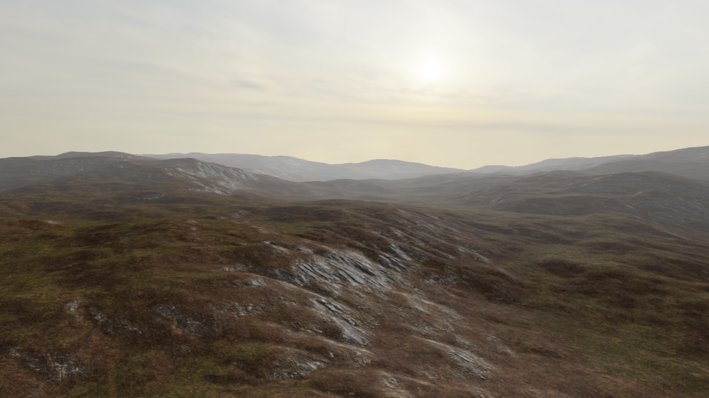
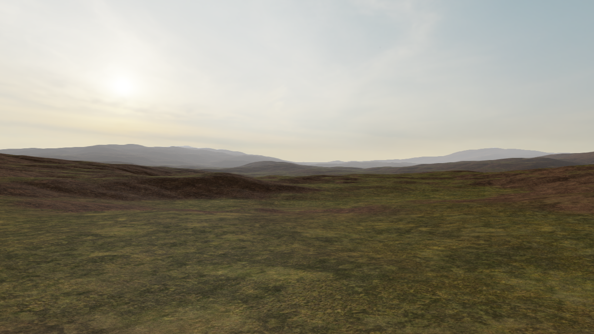
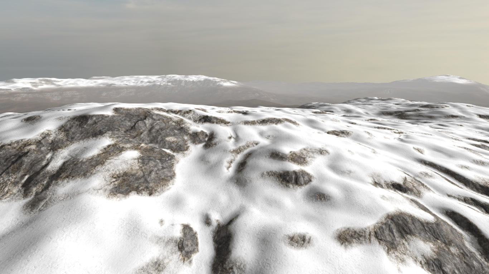
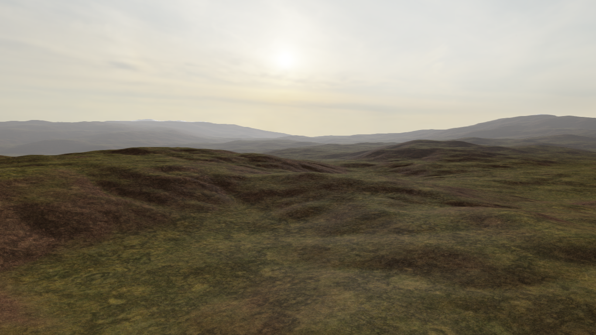
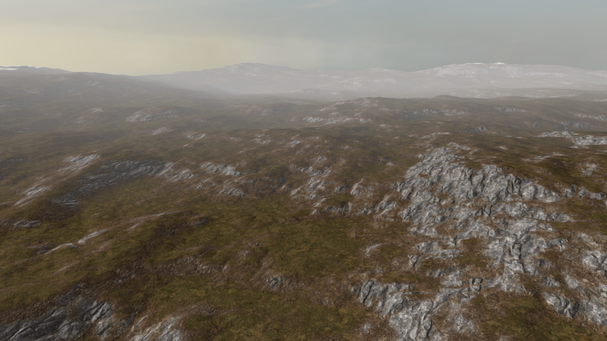
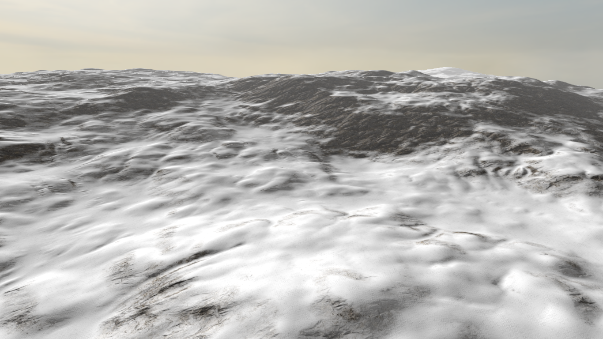
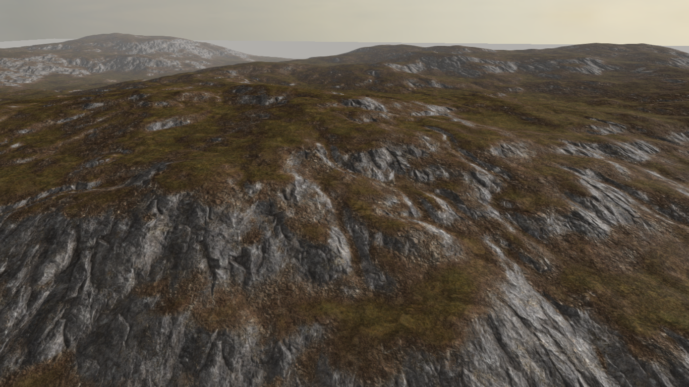
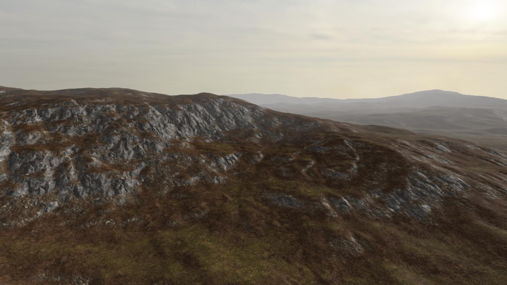
### Clipmap Rendering
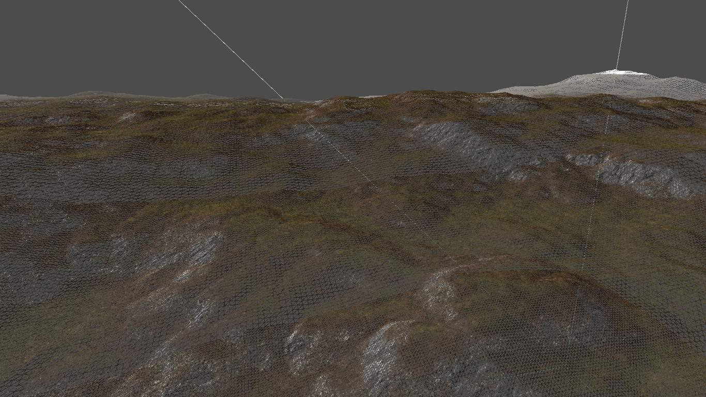
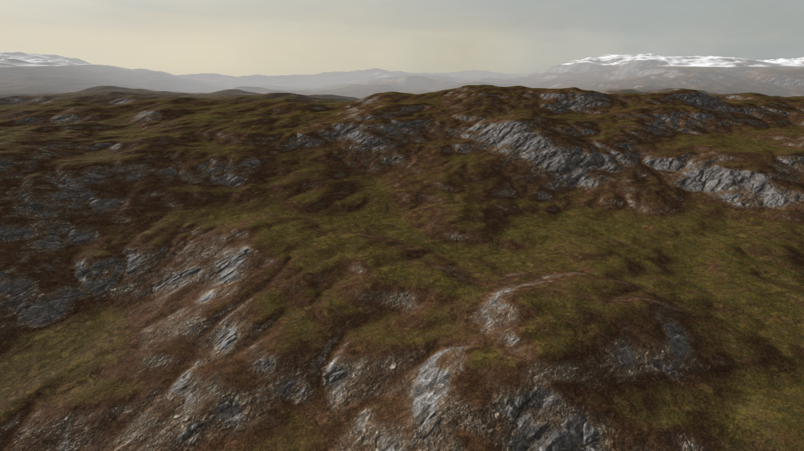
## Slope Based Dampening
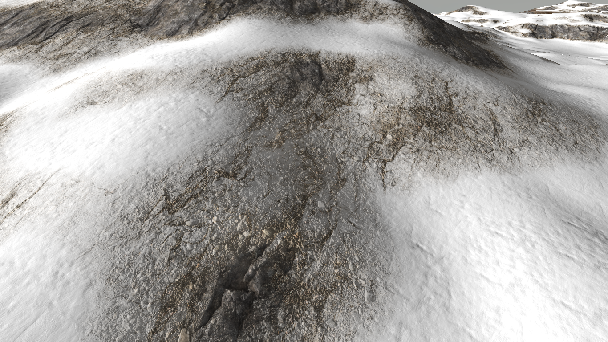
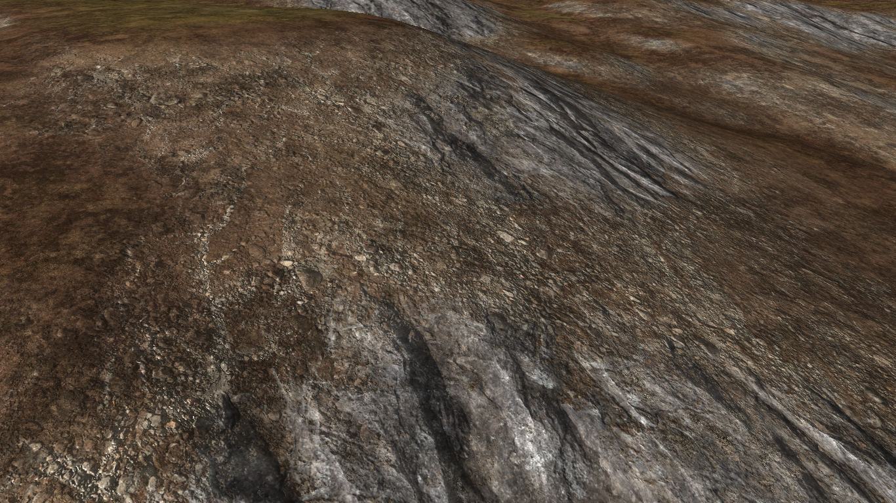
## How To Build
To run the project, open Visual Studio .sln file, set project “Application” as a startup project. Build it and copy all the binaries in the “Binaries” folder to the build directory where the .exe file was created.
## How To Use
## Future Plans
* Roads
* Vegetation (Tree, bush and grass)
* Rocks
* Lakes
* Volumetric Clouds
* Decals
## References
Clipmap rendering using nested grids. Reference : https://developer.nvidia.com/gpugems/gpugems2/part-i-geometric-complexity/chapter-2-terrain-rendering-using-gpu-based-geometry
Virtual texturing for heightmaps. Reference: https://notkyon.moe/vt/Clipmap.pdf
Procedural shader splatting. Reference : https://media.contentapi.ea.com/content/dam/eacom/frostbite/files/chapter5-andersson-terrain-rendering-in-frostbite.pdf

